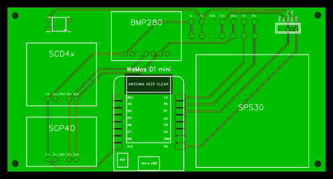
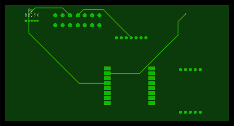

# airIQ
Indoor Air quality meter that measures CO_2, particulates, VOCs, temperature, humidity, and pressure. LED indicator displays the PM2.5 AQI by color.

## Parts list

### Processor
[Wemos D1 Mini Microprocessor](https://www.ebay.com/itm/143348901029?_trkparms=ispr%3D1&hash=item216042a4a5:g:hegAAOSwqrZg2kE3&amdata=enc%3AAQAGAAACkPYe5NmHp%252B2JMhMi7yxGiTJkPrKr5t53CooMSQt2orsS9d9gBrkNbRQtRn8MVXnYknG5bcyjjymve6wZ5WC%252BEQGjphb0P8Icz35JFe12GpU9wyYmhGLA2r6l9Mr%252Fn32V0Sd0Yl2H6jfCuY77ujk5N7TuZyN%252BMXkLjvBHeQlFdRdhBvH6m9MiaONsjAGSVOmpwt5ZhWZAfB90GsxtoePhm2Kc%252Bqs%252BVGKiHHFXXnax1jked8lTXArAKWBe9CQnTGZNpl0wWuutERnfsKEyOUlTvRaQsuOPE20T5C31C1bj7CvXtQvOZ9YmUstVbN96e9cLJBcoEEZaEnUqBXEN%252B2hzl64AEMAl2BVzE8uzEyy28my%252BvEqQeUCaykP07M%252FY2iKo2MvNBSZjNBc7QMAq2oNzXqjfoo77rdkgCb3%252FhabCPx0HbHf%252BEkSRWVAfBqCQW%252BHzjqJAbYU%252FllYinybzYp1fNyi%252FQFeeExFIsmQtFac%252BgGYyKSGbkl2TW9EeoZtYCLC9CygtwYE8SMSUzEZIyrPvH9dtJ1A3z6nLvilMkaR75hoiX1vnr7hUdhvf%252FUhqiuu8OQbMG%252FKSIys8Ncjger7%252B1L7WJ7nwaV4lJOlgk88pWIVewPT1loJbkSDzldaYkvkDvv6sF6gujlgGSibwMgNAFcOy%252BtRjYO791EtTj%252BVDVLenkx2u4st%252B2KR%252BYS1rmIJpoNcOzwcbKrGuOKBdz2566vQTYvVBGvl39Wvay38swstjadQrVaKZhWL%252FQkE%252BLofG7FB%252BMpWWZyjcdj2rRQZ0jC5BKdLElMg%252B94ZyMGuF4%252FCl7Yw2g23gi6LM2beoJ%252BhgVP9LE6L4aIQqmEWFD2dwD3GyR96kYKcxKe25FxcWwB8I%7Cclp%3A2334524%7Ctkp%3ABFBM7ufAib9f) - $20 for 5

### CO2, temperature, and humidity sensor
[Sensirion SCD40 or SCD41](https://www.adafruit.com/product/5187) - $49.50 

### VOC sensor
[Sensirion SGP40](https://www.adafruit.com/product/4829) - $14.95 

### PM2.5 sensor
[Sensirion SPS30](https://www.sparkfun.com/products/15103) -  $46.95

### Barometric pressure sensor
[Bosch BMP280](https://www.adafruit.com/product/2651) - $9.95

### Indicator LED
[NeoPixel 5050](https://www.adafruit.com/product/1655) - $4.50 for 10

## PCB Design
</IMG>
</IMG>
[Gerber files](pcb/Gerber_PCB_AirQv2_2022-01-16.zip)

#### Inspired by:
https://www.jeffgeerling.com/blog/2021/airgradient-diy-air-quality-monitor-co2-pm25 and https://howtomechatronics.com/projects/diy-air-quality-monitor-pm2-5-co2-voc-ozone-temp-hum-arduino-meter/

## Example YAML file for ESPHome
```
esphome:
  name: kitchen-air-quality
  platform: ESP8266
  board: d1_mini
  
  on_boot:
    priority: 30
    then:
      - light.turn_on:
          id: kitchen_aqi
          effect: "Display AQI"
          brightness: 50%
# Enable logging
logger:

# Enable Home Assistant API
api:

ota:
  password: set_ota password

wifi:
  ssid: your_ssid
  password: your_wifi_password

  # Enable fallback hotspot (captive portal) in case wifi connection fails
  ap:
    ssid: "Kitchen-AQ Fallback Hotspot"
    password: ap_password

captive_portal:

i2c:
  sda: 4
  scl: 5
  scan: true
  id: bus_a
# Particle sensor
sensor:
  - platform: sps30
    pm_1_0:
      name: "Kitchen PM <1µm Weight concentration"
      id: "kitchen_PM_1_0"
    pm_2_5:
      name: "Kitchen PM <2.5µm Weight concentration"
      id: "kitchen_PM_2_5"
    pm_4_0:
      name: "Kitchen PM <4µm Weight concentration"
      id: "kitchen_PM_4_0"
    pm_10_0:
      name: "Kitchen PM <10µm Weight concentration"
      id: "kitchen_PM_10_0"
    pmc_0_5:
      name: "Kitchen PM <0.5µm Number concentration"
      id: "kitchen_PMC_0_5"
    pmc_1_0:
      name: "Kitchen PM <1µm Number concentration"
      id: "kitchen_PMC_1_0"
    pmc_2_5:
      name: "Kitchen PM <2.5µm Number concentration"
      id: "kitchen_PMC_2_5"
    pmc_4_0:
      name: "Kitchen PM <4µm Number concentration"
      id: "kitchen_PMC_4_0"
    pmc_10_0:
      name: "Kitchen PM <10µm Number concentration"
      id: "kitchen_PMC_10_0"
    pm_size:
      name: "Kitchen Typical Particle size"
      id: "kitchen_pm_size"
    address: 0x69
    update_interval: 10s
  - platform: scd4x
    co2:
      name: "Kitchen CO2"
    temperature:
      name: "Kitchen Temperature"
      id: "kitchen_temperature"
    humidity:
      name: "Kitchen Humidity"
      id: "kitchen_humidity"
    update_interval: 30s
  - platform: sgp40
    name: "Kitchen VOC"
    id: "kitchen_voc"
    update_interval: 5s
    compensation:
      humidity_source: kitchen_humidity
      temperature_source: kitchen_temperature
  - platform: bmp280
    temperature:
      name: "Kitchen Temperature 2"
      oversampling: 16x
    pressure:
      name: "Kitchen Pressure"
    address: 0x77
    update_interval: 60s


    
uart:
  id: uart_2
  rx_pin: D4   
  tx_pin: D3   
  baud_rate: 115200 

light:
  - platform: neopixelbus
    type: GRB
    variant: 800KBPS
    pin: GPIO3
    num_leds: 1
    name: "Kitchen AQI"
    id: kitchen_aqi
    effects:
      - lambda:
          name: "Display AQI"
          update_interval: 30s
          lambda: |-
            auto call = id(kitchen_aqi).turn_on();
            call.set_transition_length(1000);
            call.set_brightness(0.5);
            if (id(kitchen_PM_2_5).state >= 0 && id(kitchen_PM_2_5).state < 12) {
              call.set_rgb(0, 1, 0);
            } else if (id(kitchen_PM_2_5).state >= 12 && id(kitchen_PM_2_5).state < 35) {
              call.set_rgb(1, 0.93, 0);
            } else if (id(kitchen_PM_2_5).state >= 35 && id(kitchen_PM_2_5).state < 55) {
              call.set_rgb(1, 0.4, 0);
            } else if (id(kitchen_PM_2_5).state >= 55 && id(kitchen_PM_2_5).state < 150) {
              call.set_rgb(1, 0, 0);
            } else if (id(kitchen_PM_2_5).state >= 150 && id(kitchen_PM_2_5).state < 250) {
              call.set_rgb(0.85, 0, 1);
            } else if (id(kitchen_PM_2_5).state >= 250) {
              call.set_rgb(1, 0, 0.22);
            }    
            call.perform();
```